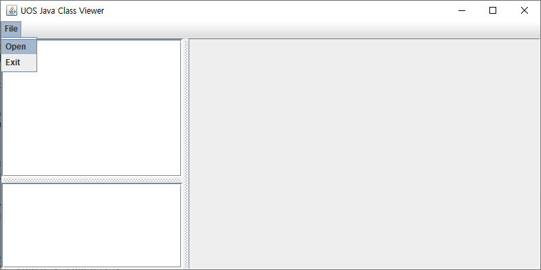
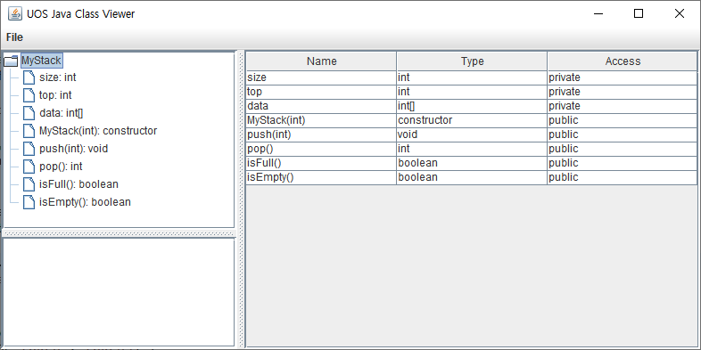
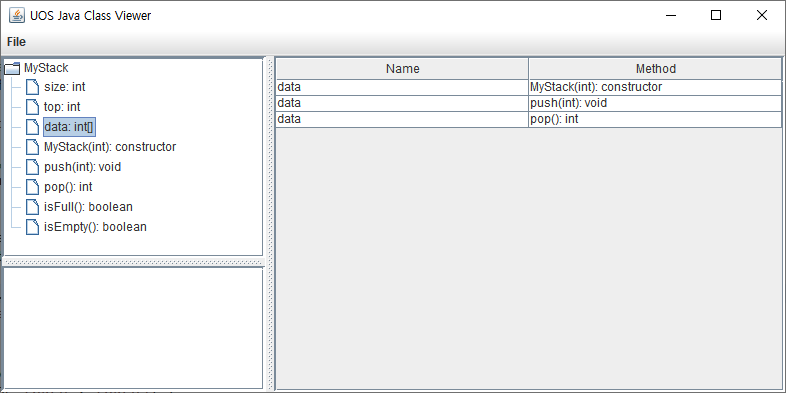
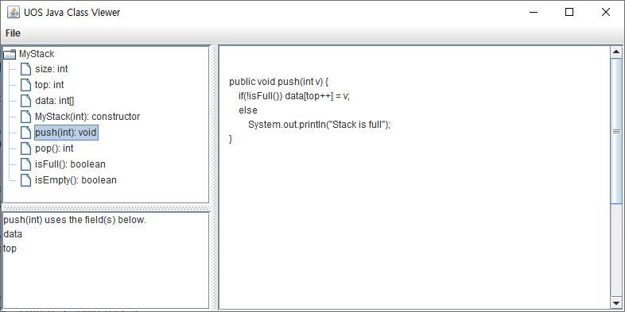

# UOS Java Class Viewer

|    학번    |     학과     |  이름  |       학기       |           강의           |
| :--------: | :----------: | :----: | :--------------: | :----------------------: |
| 2019920037 | 컴퓨터과학부 | 이성호 | 2020학년도 1학기 | 객체지향프로그래밍및실습 |

[TOC]

## 개발 개요

* Java로 간단한 Java Class Viewer를 개발함
* 원래는 아래의 'MyStack.java' 파일만 파싱할 수 있으면 되지만, 다른 class 파일도 파싱할 수 있는 방향으로 개발함

```java
class MyStack {
    private int size;
    private int top;
    private int[] data;
    
    public MyStack(int size) {
        data = new int[size];
        this.size = size;
        top = 0;
    }
    
    public void push(int v) {
        if(!isFull()) data[top++] = v;
        else
            System.out.println("Stack is full");
    }
    
    public int pop() {
        if(!isEmpty()) return data[--top];
        else
            return -1;
    }
    
    public boolean isFull() {
        if(top >= size) return true;
        else
            return false;
    }
    
    public boolean isEmpty() {
        if(top == 0) return true;
        else
            return false;
    }
}
```


## 요구 사항

1. Java 소스 파일(.java)을 파싱
2. 화면 왼쪽에 Tree 그리고 오른쪽에 텍스트 영역과 Table을 배치
3.  "File" 메뉴에 "Open", "Exit" 메뉴 아이템 추가하고 "Exit"를 선택하면 종료
4. Tree에는 Class, Method, Field가 계층적으로 위치: Tree Model 사용
5. Class 이름을 더블 클릭하면 Method와 Field를 Tree에 표시하고, 모든 Member(Method, Field)들을 Table에 표시
   - 테이블에는 Name, Type, Access 열이 위치: Table Model 사용

6. Method를 클릭하면 소스 코드를 텍스트 영역에 표시
   * 왼쪽 아래 영역에 이 Method가 사용하는 Field들을 표시(텍스트 또는 table model 사용)

7. Field를 클릭하면 Field를 사용하는 Method들을 표시: Table Model 사용


## 개발 방법

### class 파일 파싱

class 파일을 파싱하기 위해 총 4단계의 과정으로 나누었다. **첫 번째**는 class 파일의 전체적인 구조를 분석하는 과정이다. class는 이름, 메서드(method), 자료(field) 이 3가지의 정보를 나타낸다. 따라서 어느 부분이 class의 이름인지, 어디서 부터 어디까지 메서드 구간이고 자료 구간인지 파악하고 이들을 분리하는 과정을 수행한다. **두 번째**는 각각 분리된 메서드들을 파싱하여 메서드의 이름이 무엇인지, 메서드의 매개 변수의 타입(type)은 무엇인지 파악하는 과정을 수행한다. **세 번째**는 마찬가지로 각각 분리된 자료들을 파싱하여 필요한 정보를 추출하는 과정이다. **네 번째**는 파악된 class의 메서드와 자료 간의 참조 관계를 파악하는 과정이다.


#### 첫 번째 단계: Class의 전체적인 구조 분석

간단한 Java Class는 다음의 구조로 나타낼 수 있다.

```
(Access Modifier) (Class Name) {
    (Access Modifier) (Type) (Field Name) = ...;
	(Type) (Field Name);
    ...
    
    (Access Modifier) (Type) (Constructor Name) (Arguments) {
    	...
    }
    
    (Access Modifier) (Type) (Method Name)() {
    	...
    }
    
    (Type) (Method Name) (Arguments) {
    	{
    		...
    	}
    }
}
```

* 여기서 Class나 Method 그리고 Field의 구간을 Block이라고 하자. 첫 번째 단계에서는 Block을 파악하기만 하고 Block 안에 있는 내용은 나머지 단계에서 처리하도록 한다.

* Block의 시작과 끝을 저장할 수 있는 Stack을 만들어 Block을 파악할 수 있도록 한다. 그러면 Block의 시작 기호가 나타났을 때(예를 들면 `{`) Stack에 시작 위치를 push하고 Block의 끝 기호가 나타났을 때(예를 들면 `}`) Stack에서 시작 위치를 pop하여 Block을 구할 수 있게 된다.
  - Block을 파악하는 이유는 정확한 Member 위치를 파악하기 위해서이다. 또한 `StringTokenizer` 클래스를 통해 생성한 토큰으로만 Member를 파악하기에 한계가 있었다(Field Member에서 Field의 이름과 `;`이 붙어있는 경우가 있었기에, `;`가 token으로 분리되지 않아 Field Member를 파악하는데 어려움이 있었다).
  - Method Block 안에 있는 Sub Block들은 우리의 관심사가 아니므로 무시한다. 다만 나중에 Method와 Field간에 참조 관계를 분석하기 위해 저장해둔다.
* 첫 `{`가 나타났을 때는 `{`이전의 문자열들은 클래스 정보를 나타내므로 클래스의 이름을 구한다.
* `ClassInfo` Class를 만들어 클래스의 이름과 어떤 Method와 Field를 가지고 있는지에 대한 정보를 저장한다.


#### 두 번째 단계: Method 내용 분석

주어진 Method Block은 `(Access Modifier) (Method Name) (Arguments) { ... }`의 형태를 가진다. 예를 들면 다음과 같다.

```java
    public void push(int v) {
        if(!isFull()) data[top++] = v;
        else
            System.out.println("Stack is full");
    }
```

먼저 Method의 Access Modifier, Method Name을 파악하기 위해 `(`가 시작되는 위치를 파악한 후 `(` 이전, 이후의 문자열로 나눈다. 그 다음 `(` 이전의 문자열을 `StringTokenizer`를 이용해 각 예약어들을 토큰화하고 Access Modifier을 찾는다. 만약 없다면 `default` Access Modifier를 부여한다. 그리고 `(` 바로 이전의 토큰은 Method의 이름이다. 한편, `(` 부터 `)` 까지의 문자열을 토큰화한 후 Argument들의 Type을 검사한다. 이때 Argument의 이름은 우리의 관심사가 아니기 때문에 파악하지 않는다. Method의 내용을 모두 분석했다면 Method 정보를 담는 Class에 분석한 내용을 저장한다(여기선 `MethodInfo` Class).


#### 세 번째 단계: Field 내용 분석

주어진 Field Block은 `(Access Modifier) (Type) (Field Name) = ...;`의 형태를 가진다. 위의 Method 내용 분석과 비슷하게 `=` 이전의 문자열을 추출하여 토큰화해서 Access Modifier, Type, 이름을 찾는다. 여기서 주의할 점이 `=`의 여부인데, `=`이 없는 Field Block을 잘 처리해야 한다. Field의 내용을 모두 분석했다면 Field 정보를 담는 Class에 분석한 내용을 저장한다(여기선 `FieldInfo` Class).


#### 네 번째 단계: Method와 Field 간의 참조 관계 분석

Method와 Field 정보를 저장하는 class에 참조 정보를 `ArrayList`로 보관한다. Method가 Field를 참조하기 때문에 Method 입장에서 Field 참조 정보를 파악한다. Method Block의 `{ ... }` 부분을 `StringTokenizer`를 이용해 토큰화한다. 그리고 각 토큰들의 문자열과 이 Class가 가지고 있는 Field의 이름을 비교해서 서로 같다면 서로의 정보를 `ArrayList`에 보관한다. 다시 말해, Method A가 Field B를 참조하고 있으면 A의 정보를 담는 Class에 B를 저장하고, B의 정보를 담는 Class에도 A의 정보를 저장한다. 이때 주의할 점이 `" ... "` 처럼 문자열 안에 Field 이름이 들어 있는 경우이다. 이는 참조 정보를 잘못 파악할 수 있기 때문에 Method Block 안에 있는 문자열 정보를 모두 삭제하는 과정을 참조 관계 분석 전에 수행한다.


### GUI 구현

#### 기본 Layout 구성



* `JMenuBar`, `JMenu`, `JMenuItem`을 이용해서 File - Open, File - Exit 메뉴를 구현함.
* `JSplitPane`을 이용해서 왼쪽에 `JTree`와 `JTextArea`를 `JSplitPane`을 이용해서 가로 방향으로 배치하고 오른쪽에 `JTable`과 `JTextArea`를 번갈아 표시할 수 있도록 `JPanel`을 배치함.



* File - Open 메뉴를 통해 class 파일을 열게 되면 왼쪽 `JTree`에 Class의 이름을 부모 노드로 하고 Member의 이름을 자식 노드로 하는 Tree를 생성함.
  * 파일을 열기 위한 Dialog로는 `FileDialog` Class를 이용함.
  * 파싱된 정보를 담고 있는 Class(여기선 `ClassInfo`)로부터  `TreeModel`을 구현함. 그리고 `TreeModel`의 모델을 `JTree`의 모델로 설정해서 Tree를 표시함.
* 왼쪽 `JTree`에서 부모 노드인 Class 이름을 클릭하게 되면 오른쪽 `JPanel`에 불러온 Class가 가지고 있는 Member들을 표시하는 `JTable`을 배치함.
  
  * 파싱된 정보를 담고 있는 Class(여기선 `ClassInfo`)로부터 `AbstractTableModel` 상속하여 모델 Class를 구현함. 그리고 `AbstractTableModel`의 모델을 `JTable`의 모델로 설정해서 Table을 표시함.



* 왼쪽 `JTree`에서 자식 노드인 Field 이름을 클릭하게 되면 오른쪽 `JPanel`에 이 Field를 참조하는 Method들을 나열한 `JTable`이 표시됨.
  * 해당 Field 정보를 담고 있는 Instance(여기선 `FieldInfo`의 Instance)로부터 모든 참조 관계를 불러와 `AbstractTableModel`을 상속한 Class에 저장함. 그리고 이 `AbstractTableModel`의 모델을 `JTable`의 모델로 설정해서 Table을 표시함.



* 왼쪽 `JTree`에서 자식 노드인 Method 이름을 클릭하게 되면 오른쪽 `JPanel`에 이 Method의 코드를 표시하는 `JTextArea`가 표시됨.
* 그리고 왼쪽 아래의 `JTextArea`에 이 Method가 사용하는 Field들을 모두 나열함.


### 한계점 및 개선 사항

정규 표현식(Regular Expression)을 사용하면 정확한 파싱 결과를 보장할 수 있지만, `StringTokenizer`을 기본으로 사용하여 구현하려고 했기 때문에 어떤 부분이 Class이고 Method 인지 등등을 파악하기 힘들었다. 최대한 다양한 Java의 Class를 파싱하려고 시도했지만, 다음과 같은 한계가 있었다.

1. 가장 기본적인 형태의 Member인 Field와 Method만 파싱할 수 있다. 즉, `enum`이나 `inner class` 등이 들어 있는 Class는 파싱이 제대로 되지 않는다.
2. 오직 하나의 Class만 파싱 가능하다. 파일 안에 여러 Class가 있어도 파싱은 되지만, Class 정보를 저장하는 Instance는 하나 밖에 존재하지 않고, Tree View에는 하나의 Class만 표시되도록 만들었다.
   - Class 정보를 담은 Instance를 여러 개 저장할 수 있는`ArrayList`를 만들어 해결할 수 있다.
   - Tree Model의 자식 계층 구조를 더욱 세분화하여 해결할 수 있다.
3. 가장 기본적인 형태의 Access Modifier(접근 제한자)만 파싱 가능하다. 즉, 사전에 정의된 Modifier만 파싱 가능하다.
 4. 가장 기본적인 형태의 Type(자료형)만 파싱 가능하다. 즉, 사전에 정의된 Type만 파싱 가능하다.
 5. `{`, `}`, `;`, `(`, `)`와 같이 Block을 구별할 수 있는 문자들로 파싱을 하는게 이 프로그램의 핵심이기 때문에 문자열이나 주석에 저러한 문자들이 있으면 파싱이 제대로 되지 않는다.
    * 파싱하기 전에 모든 주석을 제거하여 해결할 수 있다.
    * 파싱하기 전에 모든 문자열을 제거하여 해결할 수 있다.
6. 오른쪽 Method 코드 편집기에서 코드 수정은 가능하지만 저장은 불가능하다.
   * `FileWriter` Class를 이용해서 해결할 수 있다.


## 클래스 설명

총 5가지의 클래스 종류로 나눌 수 있다.

* 첫 번째로, View를 담당하는 Class로 JavaClassViewer가 있다.
* 두 번째로, Model을 담당하는 Class로 ClassInfoTableModel, FieldReferenceTreeModel, ClassInfoTreeModel이 있다.
* 세 번째로, Parsing된 정보를 담는 Class로 ClassInfo, MemberInfo, MethodInfo, FieldInfo가 있다.
* 네 번째로, Parsing을 담당하는 Class로 ClassParser가 있다.
* 다섯 번째로, Exception Class인 ClassParsingException, EmptyClassInfoException이 있다.

### View를 담당하는 Class

#### JavaClassViewer


### Model을 담당하는 Class

#### ClassInfoTableModel


#### ClassInfoTreeModel


#### FieldReferenceTreeModel


### Parsing된 정보를 담는 Class

#### ClassInfo


#### MemberInfo


#### MethodInfo


#### FieldInfo


### Parsing을 담당하는 Class

#### ClassParser


### Exception Class

#### ClassParsingException


#### EmptyClassInfoException


## 실행 방법

## 프로그램 소스


